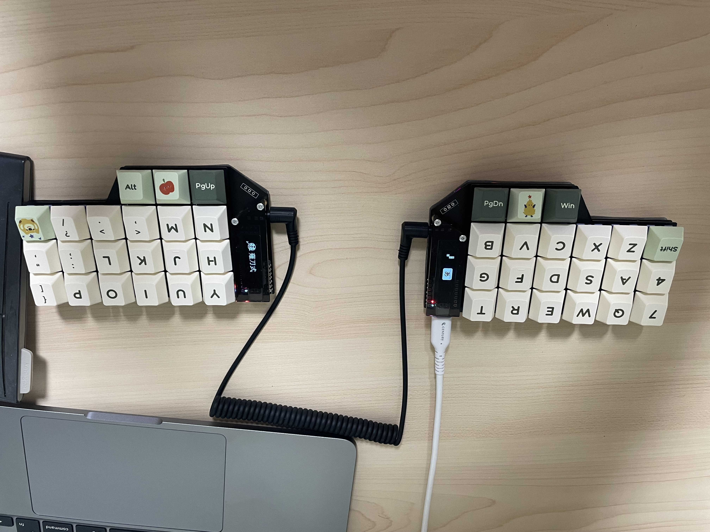

# coconut42 - split ortholinear keyboard
coconut42 は左右分割式、格子配列のキーボードです。
片側ごとのキーは縦3x横6+親指3個、両側で42キーです。
本キーボードはfoostan氏が設計されたCorne Cherryのv4.1、v3-final、v2.1の公開情報を活用させていただき、キー配列とマイコンボードを変更したものです。
foostan氏のご厚意に感謝いたします。

## 部品
### 必須
|名前|数|備考|
|:-|:-|:-|
|PCB|2枚||
|トッププレート|2枚||
|ボトムプレート|2枚||
|Seeed Studio XIAO RP2040|2枚||
|TRRSジャック|2個|MJ-4PP-9|
|ダイオード|50個|1N4148W SOD123|
|Kailh PCBソケット|42個|MX用|
|キースイッチ|42個|CherryMX互換にのみ対応 |
|キーキャップ|42個|1u|
|スペーサー M2 7.5mm全ネジ|10本||
|ネジ M2 4mm|20本||
|クッションゴム|8個||
|TRS(3極)ケーブル|1本|TRRS(4極)ケーブルでも可 |
|USB type Cケーブル |1本||
### 任意
| 名前 | 数 | 備考 |
|:-|:-|:-|
|リード線 2cm程度|2本|LEDとOLEDの電源供給用|
|抵抗1/6W470Ω|2本|R1,R6で。小さいサイズも可。やむを得ない場合ジャンパー|
|WS2812B|12個|下向き実装|
|YS-SK6812MINI-E|42個|上向き実装|
|OLEDモジュール|2枚||
|ピンヘッダ 4連|2個||
|ピンソケット4連|2個||
|OLEDカバー|2枚|Corne Cherryのものと交換可能|
|スペーサー M2 9mm全ネジ|4本||
|ネジ M2 4mm|4本||
## 注意点
* LEDまたはOLEDを取り付ける場合は、マイコンボードの裏にある「VIN」とPCBの「VIN(-r)」をリード線でつなぐ必要があります。
* LEDを取り付ける場合は、R1とR6も取り付けます。  
470Ωを入れるのは、電源供給が一瞬途絶えたときの安全対策です。
* R2,R7は、Seeed Studio XIAO ESP32C3対応を考えたためです。
* C7〜C27,C34〜C54,R3〜R5,R8〜R10は、ノイズ対策が必要になれば取り付けます。
* PCB上面のC1〜C6,C28〜C33、PCB下面のOLEDソケットそばのC55,C56は __不要__ です。
* 向きを間違えればマイコンボードを壊すので、回路図、PCBに保護ダイオードを書きませんでした。
## 別のマイコンボードへの対応
おすすめできませんが、できるものもあります。
### Seeed Studio XIAO nRF52840
ZMK Firmwareが改良二乗マトリクスに対応しています。
LEDは光らせられませんでした（仮にできたとしても、Blutooth通信の低下になるという）
[左側の裏を写した写真](images/IMG_0197.jpeg) [右側の裏を写した写真](images/IMG_0196.jpeg)
* OLED、TRRSジャックはつけない。リチウムイオン充電池を両面テープで貼り付け、プラス線は BAT+ につなぐ。マイナス線からは BAT- につなぐ途中に電源スイッチを入れる。
* 左右間通信はBluetoothで行う。
* キーを押していないときにはマイコンを眠らせたいので、[Low Power Improved Square Matrix](https://kbd.news/Low-Power-Improved-Square-Matrix-1810.html)の[この回路図](https://kbd.news/pic/article/1810/4-pin-improved-square-matrix-low-power.png)のようにダイオードをマイコン取り付け部の下側につける。  
割り込みピンは左右間通信用だった「data」を流用する。
* VINにはVBUSをつなぐ
### Seeed Studio XIAO ESP32C3/6
使用できません。
### Waveshare RP2040-Zero
* 電源ピンを合わせるため、裏返してコンスルーピンヘッダを介してハンダ付けし、ピンの機能に合わせてプログラムを作り替えれば動くと思われる。
* VINにはVSYS(5V)をつなぐ
* マイコンボードを外さなければ、ファームウェアを書き込むリセットができません
